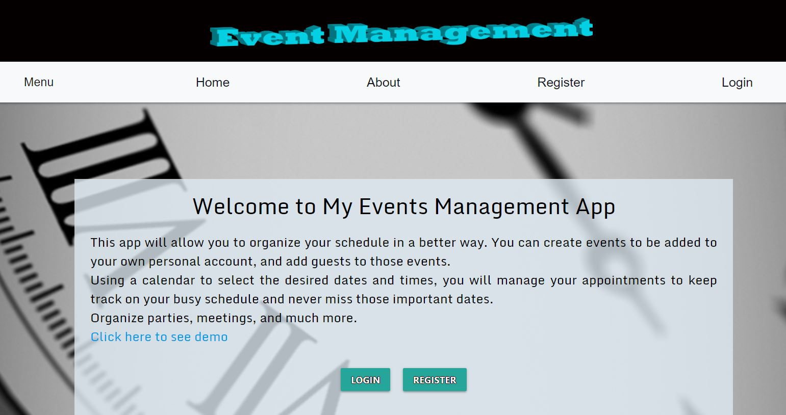
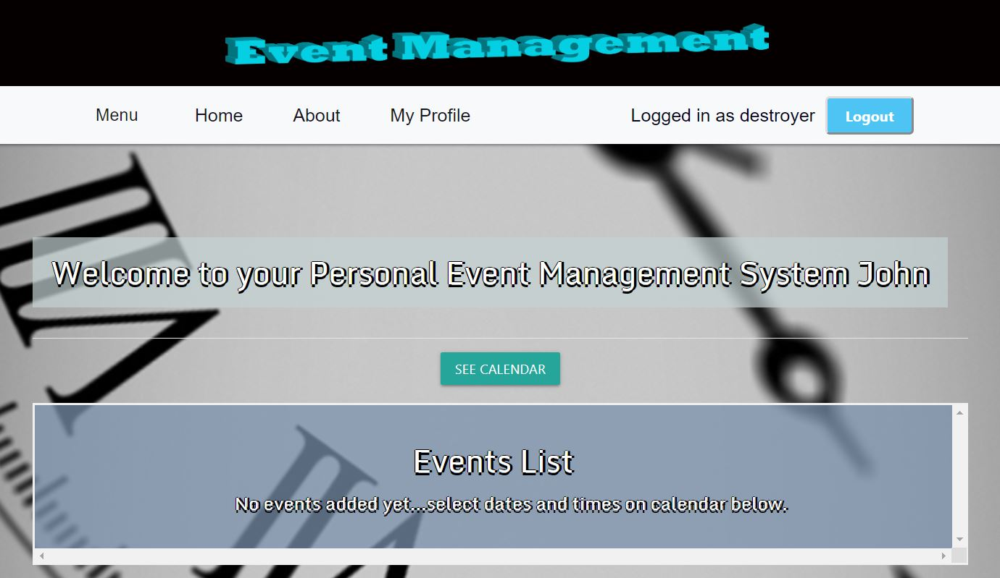
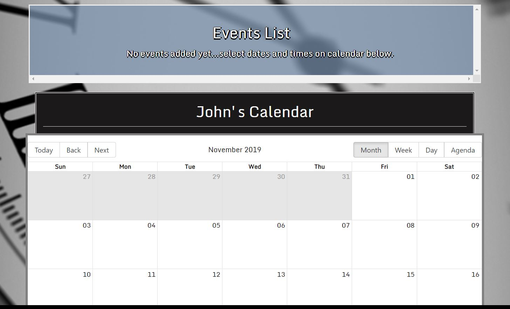
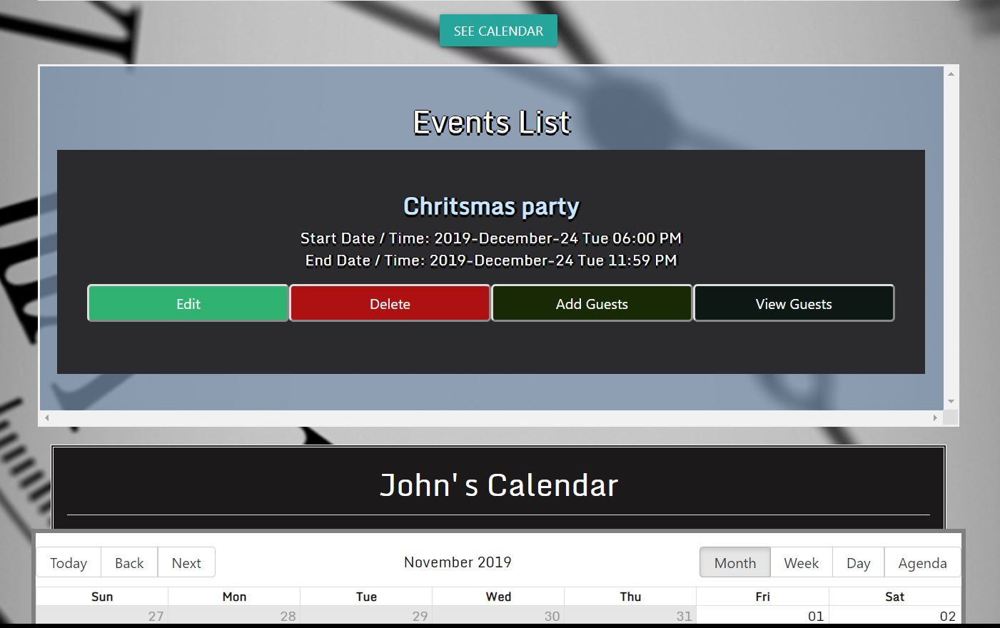
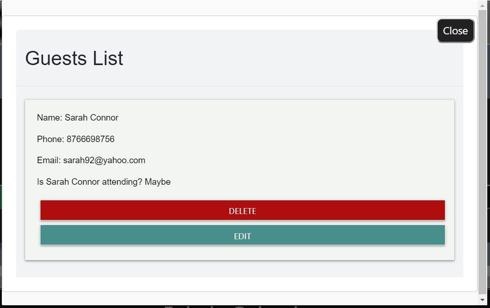
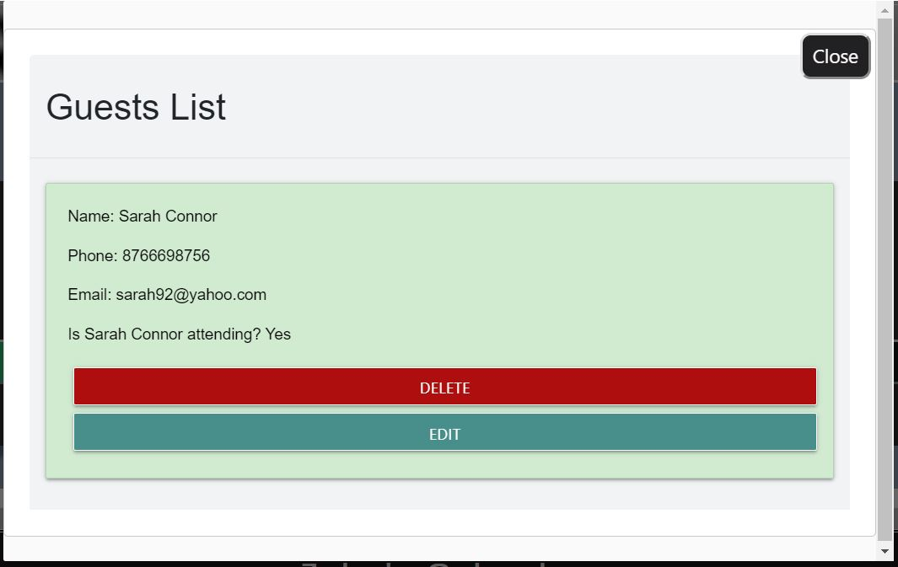

# Event Management System

Link to deployed app on heroku: https://alexis-event-handler.herokuapp.com/   

Note: The app is hosted in Heroku using the Free Dynos; therefore, it might take a few seconds to wake up. Once it loads, it will run fast and smoothly.

Credentials to test the app:  
email: alexfullstackdev@gmail.com  
password: 123456

Or you can also create an account easily.

- This full stack application will allow you to organize events in a better way

- Once the users register and sign in, they will be redirected to their personal profile

- From here, a calendar will allow them to create events, which will appear on top of the page as a list.

- After creating an event, this can be edited or deleted from the list view, or from the actual calendar.

- It also has the option to add guests to this events and keep track on who has confirmed to assist and who hasn't:  
  If the guest is attending, then the background will turn green, on the contrary, if it has not responded yet or it's undecided, the guest's background will remain white.

# Technologies Used

### Front-end

- React Js
- HTML
- Css
- Bootstrap
- Adobe Illustrator and Photoshop

### Back-end

- Node Js
- Express
- Passport
- Json Web Token
- MongoDb Atlas

Link to deployed app on heroku: https://alexis-event-handler.herokuapp.com/   

Note: The app is hosted in Heroku using the Free Dynos; therefore, it might take a few seconds to wake up. Once it loads, it will run fast and smoothly.

Credentials to test the app:  
email: alexfullstackdev@gmail.com  
password: 123456

Or you can also create an account easily.
